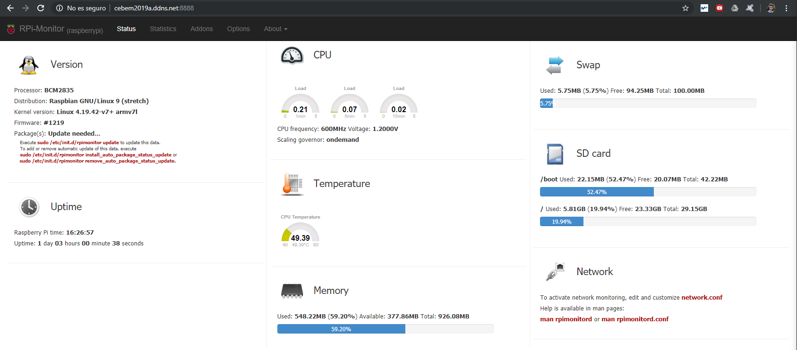

<h1>Instalación servicio RPI Monitor</h1>

__RPI Monintor__ es un servicio que permite monitorizar parámetros de una __raspberry__ a traves de una página web, permite ver valores como la versión del sistema, uso de memorias o temperatura. Esta funcion es sobre todo util para sistemas sin entorno gráfico.

Para instalarlo lo primero es conectarse a la raspberry mediante __SSH__, en mi caso el comando necesario para ello es ssh pi@cebem2019a.ddns.net, tras introducir la contraseña ya estamos conectados a la raspberry.

Los comandos necesarios para instalar este servicio son los siguinetes:

```bash
sudo apt-get install apt-transport-https ca-certificates
sudo wget https://goo.gl/vewCLL -O /etc/apt/sources.list.d/rpimonitor.list
sudo apt-key adv --recv-keys --keyserver keyserver.ubuntu.com 2C0D3C0F
sudo apt update
sudo apt install rpimonitor
```

En mi caso antes de reailaz el tercer comando tuve que instalar dirmngr con el siguiente comando:

```bash
sudo apt-get install dirmngr
```

Esto configurará en el servicio por defecto en el puerto 8888.

Ahora podremos comprobar el estado de la raspberry en la siguiente dirección:

http://cebem2019a.ddns.net:8888/

